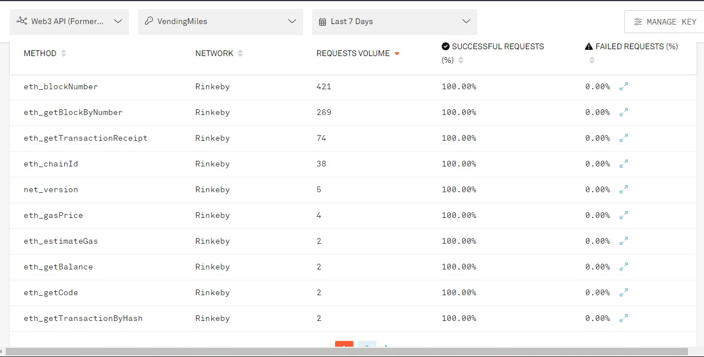
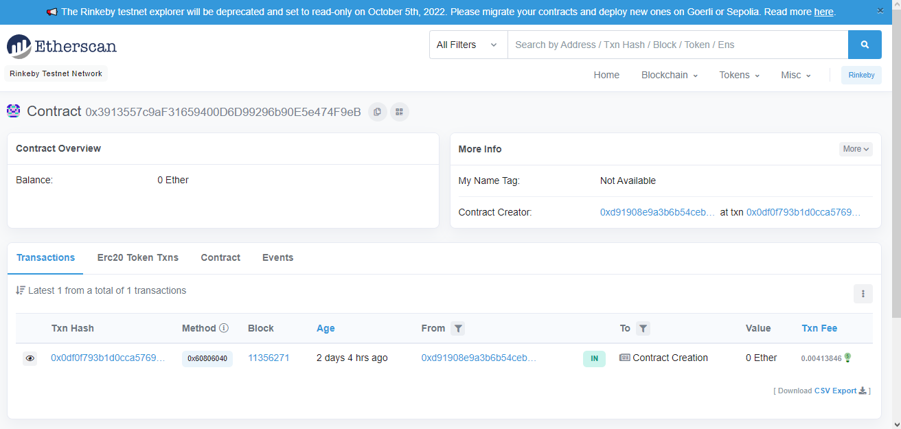

[Voltar](../Readme.md)


## Deploy Local


```bash
truffle deploy
```

Deploy realizado em rede local


## Deploy na rede Rinkeby


#### Variaveis de Ambiente

utilizamos o dotenv para a criacao das variaves de ambiente 

.env modelo


Deploy realizado na rede Rinkeby

```bash
truffle deploy --network rinkeby
```


Em seguida podemos ver mais alguma informações interessantes a respeito do deploy realizado. Como a quantidade de requests feitas:


E também informações sobre o deploy em si.



Por fim o endereço do deploy na rede de testes Rinkeby Etherscan.

