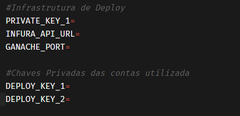
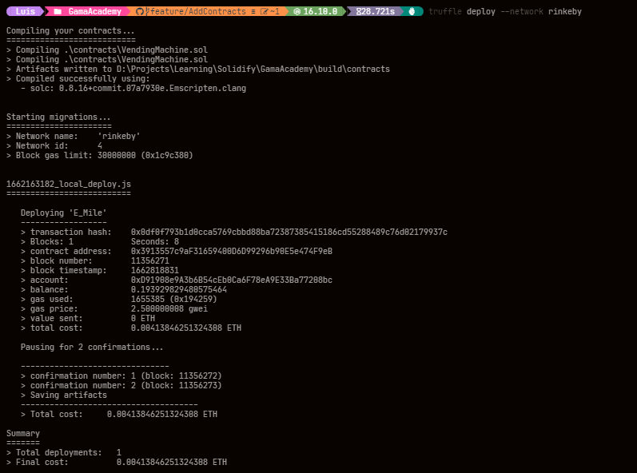

[Voltar](../Readme.md)


## Deploy Local


```bash
truffle deploy
```

Deploy realizado em rede local


## Deploy na rede Rinkeby


#### Variaveis de Ambiente

utilizamos o dotenv para a criacao das variaves de ambiente 

.env modelo




Deploy realizado na rede Rinkeby

```bash
truffle deploy --network rinkeby
```

