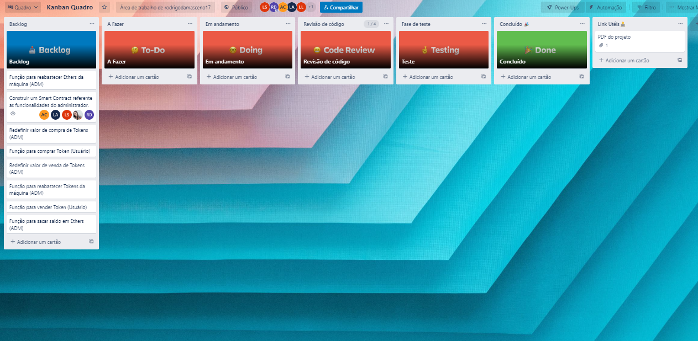
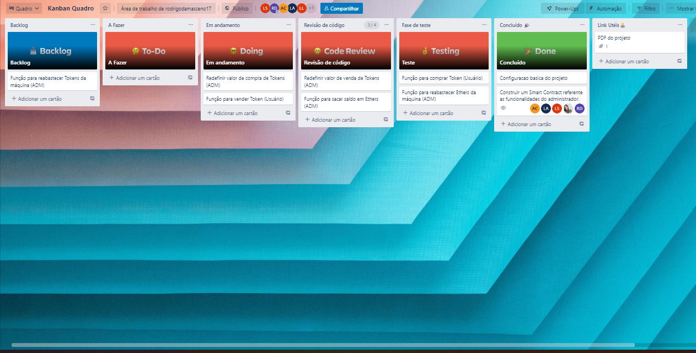
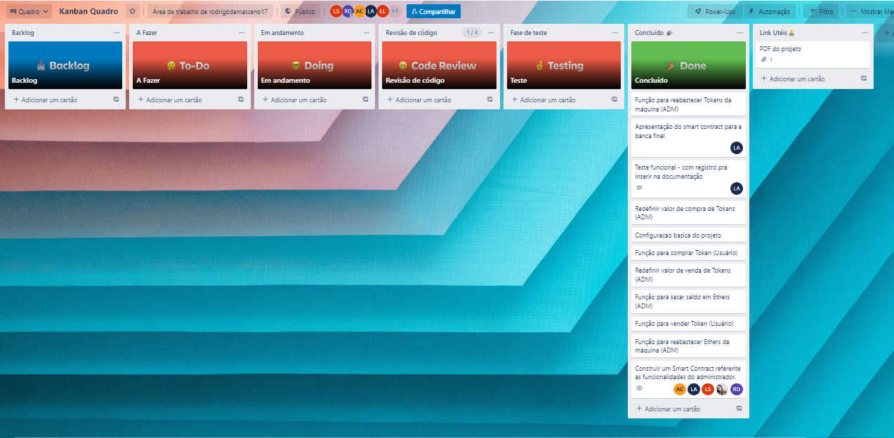

[Voltar](../Readme.md)

Para o controle do fluxo de desenvolvimento deste código foi utilizado o modelo Kanban feito na ferramenta Trello. Sua estrutura foi feita da seguinte forma:

## Visao geral do Kambam

## Andamanto do Projeto

## Final do MVP
