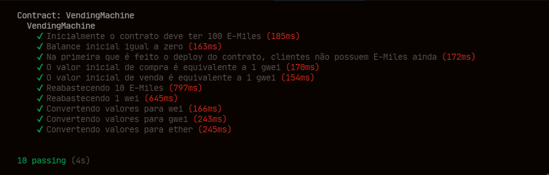

[Voltar](../Readme.md)

## Implementacao dos testes de Integracao

## Testes Funcionais 

### Teste no Remix by Owner

#### Função PriceMilesPurchase

#### Função PriceMilesSelll

#### Função restokEther

#### Função restokMiles

#### Função withdraw

### Teste no Remix by User

#### Função priceMilesPurchase

#### Função PriceMilesSelll

#### Função restokEther

#### Função restokMiles

#### Função withdraw

