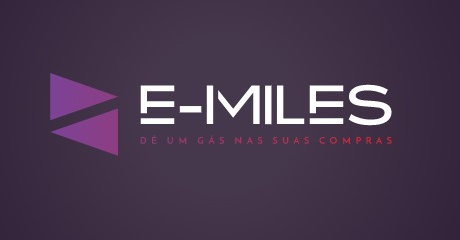

# 

## Gestao do Projeto

Mostra com fizemos o gerenciamento do projeto , através do Trello

[Trello](./.readme/gestao.md)

## Tecnologias Aplicadas

 -     
 -  	  
 -    

## Configuração ambiente / Instalação local / Testes da aplicação 

[Configuracao](./.readme/config.md)

[Testes](./.readme/testes.md)

## Colaboradores 

  

  

    

    

  

     

## Deploy 

[Deploy](./.readme/deploy.md)

## Aplicacao (react) opcional 